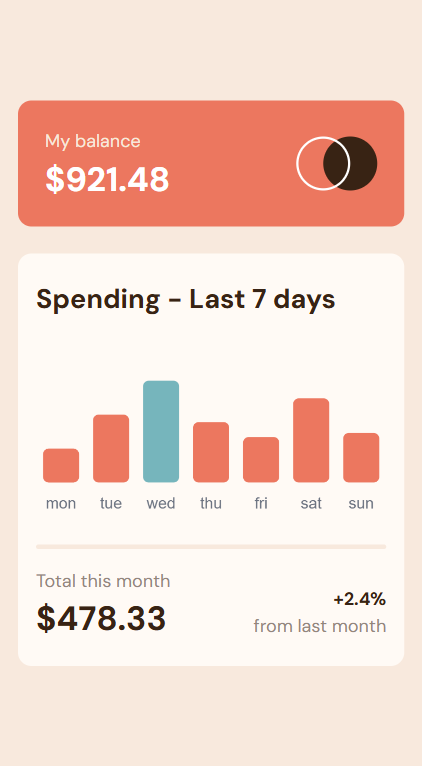
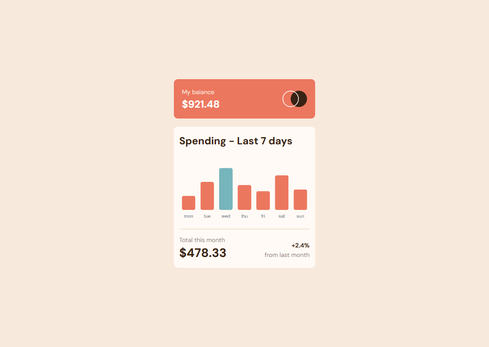

# Frontend Mentor - Expenses chart component solution

This is a solution to the [Expenses chart component challenge on Frontend Mentor](https://www.frontendmentor.io/challenges/expenses-chart-component-e7yJBUdjwt). Frontend Mentor challenges help you improve your coding skills by building realistic projects.

## Table of contents

- [Overview](#overview)
  - [The challenge](#the-challenge)
  - [Screenshot](#screenshot)
  - [Links](#links)
- [My process](#my-process)
  - [Built with](#built-with)
  - [What I learned](#what-i-learned)
  - [Continued development](#continued-development)
  - [Useful resources](#useful-resources)
- [Author](#author)
- [Acknowledgments](#acknowledgments)

## Overview

### The challenge

Users should be able to:

- View the bar chart and hover over the individual bars to see the correct amounts for each day
- See the current day’s bar highlighted in a different colour to the other bars
- View the optimal layout for the content depending on their device’s screen size
- See hover states for all interactive elements on the page
- **Bonus**: Use the JSON data file provided to dynamically size the bars on the chart

### Screenshot




### Links

- Solution URL: [Github Repo](https://github.com/stephany247/expenses-chart-component)
- Live Site URL: [Live Demo](https://expenses-chart-component-plum.vercel.app/)

## My process

### Built with

- Semantic HTML5 markup
- CSS custom properties
- Flexbox
- CSS Grid
- Mobile-first workflow
- [React](https://reactjs.org/) - JS library
- [Vite](https://vitejs.dev/) - Build tool
- [TypeScript](https://www.typescriptlang.org/) - Strongly typed JavaScript
- [Chart.js](https://www.chartjs.org/) - Data visualization library
- [react-chartjs-2](https://react-chartjs-2.js.org/) - React wrapper for Chart.js

### What I learned

While working on this project, I gained a deeper understanding of integrating Chart.js with React and customizing tooltips, labels, and bar styling. I also learned how to handle dynamic data updates efficiently in a chart component.

One key takeaway was how to remove unwanted grid lines and customize tooltip positioning:

```js
options: {
  plugins: {
    tooltip: {
      yAlign: "top",
      xAlign: "center",
      caretSize: 0,
    },
  },
  scales: {
    x: {
      grid: { display: false },
    },
    y: {
      border: { display: false },
    },
  },
}

```

### Continued development

Moving forward, I want to refine my understanding of advanced Chart.js customization, including animations and interactivity. I'll also focus on improving accessibility in data visualizations and exploring alternative charting libraries to compare performance and ease of use.

### Useful resources

- [Chart.js Documentation](https://www.chartjs.org/docs/latest/) - This was my primary reference for configuring and customizing the chart, including tooltips and scales.
- [React Chart.js 2](https://react-chartjs-2.js.org/) - This library's documentation helped me integrate Chart.js seamlessly with React.
- [Tailwind CSS Documentation](https://tailwindcss.com/docs) - Provided a utility-first approach to styling, making it easier to structure and style components quickly.- Helped me manage styles efficiently using CSS variables.


## Author


- Website - [Onyinye Stephanie Oguocha](https://www.your-site.com)
- Frontend Mentor - [stephany247](https://www.frontendmentor.io/profile/stephany247)
- Twitter - [@stephanyoguocha](https://x.com/stephanyoguocha)


## Acknowledgments

A big thank you to the open-source community and documentation from Chart.js and React-Chartjs-2 for making implementation smoother. Also, appreciation to Frontend Mentor for providing the challenge that helped me improve my skills.
